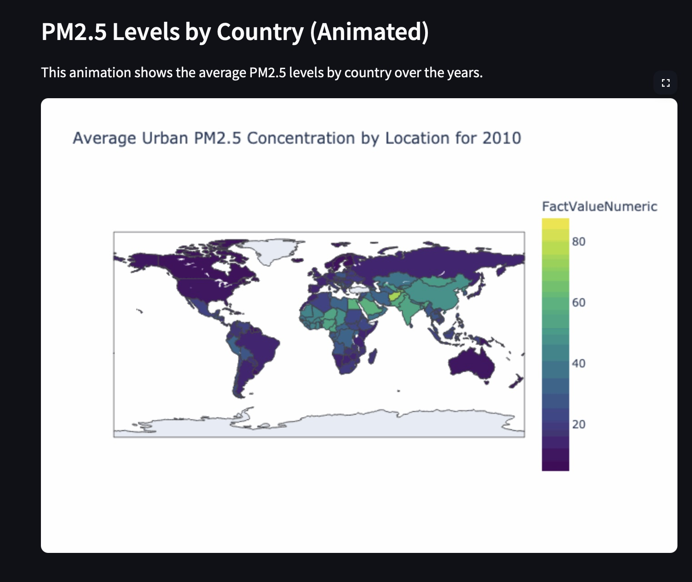
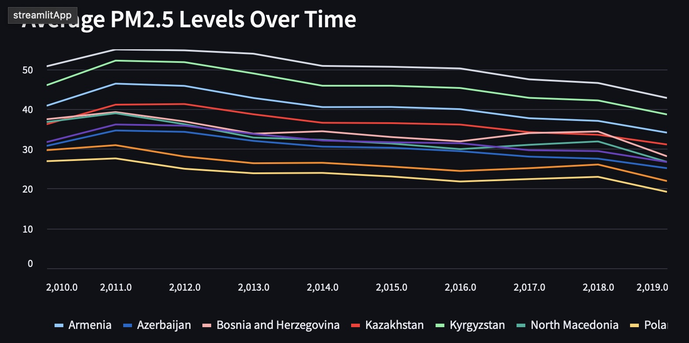
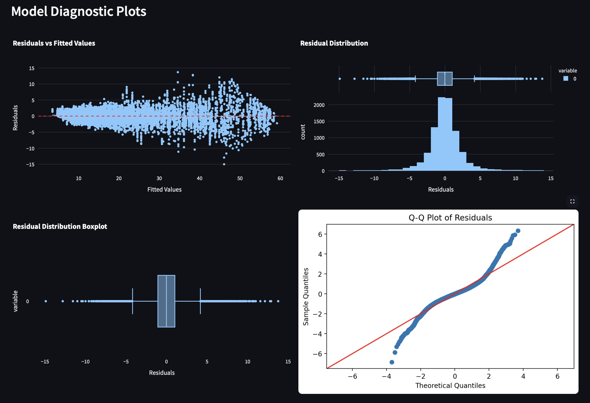

# Urban PM2.5 Concentration Analysis


## **Project Overview**  
This project focuses on retrieving, cleaning, and exploring real-world data on **annual mean PM2.5 concentrations** in urban areas across different countries. The dataset provides a population-weighted average of fine particulate matter (PM2.5) in cities, which is a critical indicator of environmental health risk.

You will simulate an end-to-end exploratory data analysis (EDA) process, aligning with the following objectives:
- Retrieve and load the data from CSV, JSON, and/or remote sources.
- Clean the data by managing missing values and identifying outliers using statistical techniques.
- Use residual-based methods to flag anomalies.
- Document your process in Jupyter Notebooks and build an interactive Streamlit dashboard for reporting findings.

This project mirrors a professional workflow you'd follow in data science consulting or research to prepare high-quality environmental data for downstream ML tasks or policy analysis.


The final product includes:
- A step-by-step data analysis notebook for technical users
- A Streamlit dashboard app for non-technical users and policymakers


## 📊 Data
### **Downloaded from:** 
   * https://www.who.int/data/gho/data/themes/air-pollution/who-air-quality-database/2022

- Indicator: Annual mean PM2.5 concentration (µg/m³)
- Coverage: Urban populations worldwide
- Measurement Source: Satellite data + ground monitoring integration
- Fields: Country, Year, Urban Population, PM2.5 Concentration
- Frequency: Updated every 2–3 years
- Source: WHO Global Air Quality Database

### Full meta data:
```
Indicator name:
Annual mean concentration of particulate matter of less than 2.5 microns of diameter (PM2.5) [ug/m3] in urban areas
Short name:
Annual mean PM2.5 concentration in urban areas
Data type:
Statistic
Indicator Id:
4674
Topic:
Risk factors
ISO Health Indicators Framework
Environmental factors
Rationale:
Air pollution consists of many pollutants, among other particulate matter. These particles are able to penetrate deeply into the respiratory tract and therefore constitute a risk for health by increasing mortality from respiratory infections and diseases, lung cancer, and selected cardiovascular diseases.
Definition:
The mean annual concentration of fine suspended particles of less than 2.5 microns in diameters is a common measure of air pollution. The mean is a population-weighted average for urban population in a country.
Method of measurement
Concentration of PM2.5 are regularly measured from fixed-site,  population-oriented monitors located within the metropolitan areas. High-quality measurements of PM concentration from all the monitors in the metropolitan area can be averaged to develop a single estimate.  
Method of estimation:
Although PM is measured at many thousands of locations throughout the world, the amount of monitors in different geographical areas vary, with some areas having little or no monitoring. In order to produce global estimates at high resolution (0.1◦ grid‐cells), additional data is required. Annual urban mean concentration of PM2.5 is estimated with improved modelling using data integration from satellite remote sensing, population estimates, topography and ground measurements.
Preferred data sources:
Special studies
Expected frequency of data dissemination:
Every 2-3 years
Expected frequency of data collection:
Every 2-3 years
```

## ⚙️ Installation Instructions

1. Create and activate virtual environment:
```bash
python3 -m venv .venv

# Activate:
source .venv/bin/activate       # macOS/Linux
.venv\Scripts\activate          # Windows

# Upgrade pip
pip install --upgrade pip      

# Install all dependencies
pip install -r requirements.txt 

# Verify installed packages
pip list 
```

## 🔬 Project Walkthrough

### 📓 Part 1: Notebook Analysis (For Data Scientists / Coders)

**Note:** In VS Code, at top right corner click on select kernel and choose the .venv that you created. 

1. 01_data_loading_exploration.ipynb
   - Loads the raw dataset
   - Displays data structure and basic statistics
   - Visualizes distributions and missing values

2. 02_cleaning_missing_outliers.ipynb
   - Detects and handles missing data via interpolation
   - Flags outliers using IQR/Z-score
   - Saves cleaned data to `processed/` directory

3. 03_data_summary_and_features.ipynb
   - Conducts deeper statistical analysis
   - Builds engineered features for modeling
   - Prepares the final dataset for dashboard use


### 📊 Part 2: Interactive Dashboard (For General Users)

To view the app in your own browser, click this [link](https://zkhechadoorian-pm25-streamlit-apphome-59cprf.streamlit.app). Alternatively, you can follow the steps below to launch the app locally. 

1. Launch the Streamlit App:
```bash
cd streamlit_app 
## run server
streamlit run Home.py
## to stop server press `control + c`
```

2. Open the app:
Navigate to `http://localhost:8501` in your browser.

3. Explore Dashboard Sections:
- 🏠 Home:Project goals and summary statistics
- 🌍 Urban PM25 Overview: Interactive global maps and time series trends
- 🧼 Missing Outlier Report: Visual reports of missing values and outliers
- 📈 Regression Analysis: Anomaly detection and predictive insights
- Global PM25 Overview: GIF choropleth of average PM25 levels over the years
- Average PM25 By Region: average PM25 levels over time for each country in a given region

Below are some screenshots of the app! 






4. File Structure:
```
streamlit_app/
│
├── Home.py                # Main entry point for the app
├── pages/                 # Contains sub-pages for dashboard sections
├── scripts/               # Core functions (cleaning, analysis, plotting)
└── tests/                 # Unit tests
```

## 🧪 Testing and Validation

In large applications, we want to ensure that future developments don't change previous confirmed results. One way to perform this test is to run our codes on one same dataset after each development and make sure the results are not affected. 


✅ What is Tested In this Test:
- Missing value handling logic
- Outlier detection thresholds
- Data type and column consistency

🧪 Run Tests:
```bash
pytest tests/test_cleaning.py -v
```
